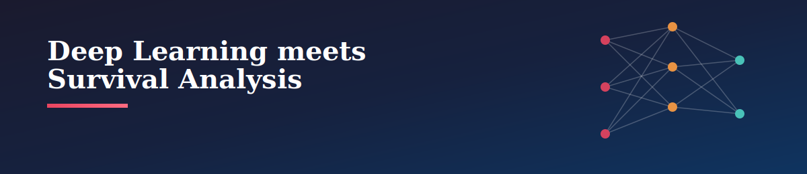
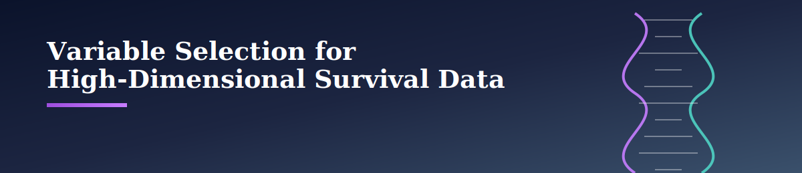

<div align="center">

# 🧠 Research Framework
### Advanced Statistical & Machine Learning Methods for Time-to-Event Data


*Three complementary research directions spanning reliability engineering, biomedicine, and insurance — unified by the goal of modeling time-to-event data more flexibly, interpretably, and reliably.*

</div>

---

## 📋 Table of Contents

| # | Topic | Domain Focus |
|---|-------|---------------|
| 1 | [Semiparametric Effective Age Framework for Recurrent Event Modeling](#-a-semiparametric-effective-age-framework-for-recurrent-event-modeling) | Reliability · Biomedicine |
| 2 | [Integrating Deep Learning and Survival Analysis](#-integrating-deep-learning-and-survival-analysis-for-reliable-event-prediction) | Healthcare · Engineering · Insurance |
| 3 | [Variable Selection for High-Dimensional Survival Modeling](#-variable-selection-for-high-dimensional-survival-data-under-cross-study-heterogeneity) | Genomics · Precision Medicine|

---

## 🔧 A Semiparametric Effective Age Framework for Recurrent Event Modeling


### The Problem

Systems that experience **recurrent events** — repeated failures in machinery, disease recurrence in patients, repeated insurance claims — are everywhere. Interventions like maintenance, treatment, or claims processing can reset or partially reset the clock on future events. This "clock" is the system's **effective age**, and capturing it well is surprisingly hard.

> Most existing tools, like the Cox proportional hazards model, describe *how risky* an event is at a given moment — not *how much sooner or later* it will occur. Effective age models fill part of that gap but are still largely hazard-based, without a unified way to capture both covariate and intervention effects on timing directly.

**Why it matters:** getting this wrong leads to costly maintenance schedules, less personalized treatment plans, and inaccurate risk pricing.

### The Approach

This research builds a **semiparametric effective age framework grounded in accelerated gap-time models**, directly modeling how covariates and interventions *accelerate or delay* recurrent event timing — rather than just how they shift risk.

<details>
<summary><b>🏷️ Keywords</b></summary>
<br>


</details>

---

## 🤖 Integrating Deep Learning and Survival Analysis for Reliable Event Prediction



### The Problem

Modern time-to-event datasets are **high-dimensional, longitudinal, and complex** — and traditional survival models often rely on restrictive assumptions that don't hold up, especially for recurrent events where the *history and sequence* of prior events matters.

> Deep learning can capture nonlinear relationships and complex temporal patterns that classical models miss — but at a cost. Most deep survival models are **black boxes**: strong predictive performance, little statistical transparency. Classical models offer the opposite trade-off.

**Why it matters:** in healthcare, engineering, and insurance, decision-makers need models they can both *trust* and *understand* — not just ones that score well.

### The Approach

This research develops frameworks that **integrate deep learning with survival analysis**, aiming for a balance of predictive accuracy, interpretability, and statistical reliability across single-event and recurrent-event settings.

<details>
<summary><b>🏷️ Keywords</b></summary>
<br>


</details>

---

## 🧬 Variable Selection for High-Dimensional Survival Data Under Cross-Study Heterogeneity



### The Problem

**Individual-participant-data (IPD) meta-analysis** lets researchers combine multiple cohorts to better understand time-to-event outcomes — crucial in genomics, where gene expression data offers thousands of candidate biomarkers.

> The catch: cohorts differ. Existing penalized survival models often assume **homogeneous effects across studies**, or select variables independently within each one — missing the chance to capture population-specific differences while still finding biomarkers that hold up broadly.

**Why it matters:** in genomic research, this leads to unstable gene selection, poor reproducibility, and biomarkers that don't generalize across patient populations.

### The Approach

This research develops a **hierarchical penalized survival modeling framework** that jointly captures shared and study-specific covariate effects in high-dimensional IPD meta-analysis — combining structured variable selection with advanced penalization to identify robust, generalizable biomarkers.

<details>
<summary><b>🏷️ Keywords</b></summary>
<br>


</details>

---

## 🔗 How the Topics Connect

```
Topic 1 (Effective Age / AFT Models)  ──┐
                                          ├──►  Unified goal: better time-to-event
Topic 2 (Deep Learning + Survival)    ──┤        modeling for engineering,
                                          │        healthcare & insurance
Topic 3 (High-Dim Variable Selection) ──┘
```

All three research lines push survival analysis beyond classical hazard-based assumptions — toward models that are more **flexible** (Topics 1 & 2), more **interpretable** (Topic 2), and more **robust across heterogeneous populations** (Topic 3).

<div align="center">

---

*Prepared as a research framework overview — reach out for full proposals, methodology details, or collaboration inquiries.*

</div>
